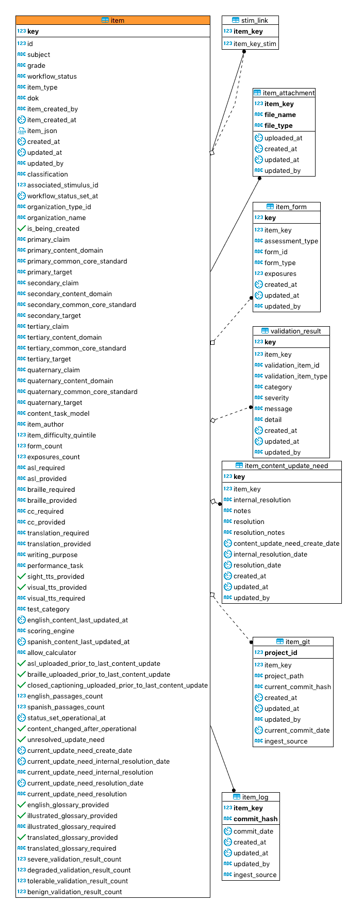

# IMRT Database

[Go Back](../README.md)

IMRT uses Postgres 9.6.  All tables are in the **imrt** schema.

There are three types of tables in the system:

* Item Tables - tables containing item data
* Job Tables - tables used during the sync process
* Application Tables - tables that are used as part of the application

## Schema Design
The scheam image below was created using [DBeaver](https://dbeaver.io/) free SQL Editor.  It can be downloaded and run to create the Entity Relationship Diagram (ERD).

## Item Tables
The item tables contain data related to the item.  These tables are populated during the item ingest from the itembank.  The itembank is currently a hosted Gitlab server, and some of the tables are related to the itembank information gathered from the Gitlab service.

The table below desrcibes what each table represents:

| Table| Description |
| --- | --- |
| item | contains the searchable item data |
| stim_link | contains the stim and item relationship when present |
| item_git | contains data about the itembank location within Gitlab |
| item_log | contains the git commit history for the item |
| item_attachment | contains the closed captioning, braille, and ASL attachment information for items |
| item_form | contains the post administration form data associated with an item | 
| validation_result | contains the validation errors for the current version of the item from the tabulator |
| item_content_update_need | contains the items' content update needs |

### Audit Fields 
The table below lists the audit fields present in each table within IMRT's database.

| Column Name | Item Data Dictionary Canonical Name | Data Type | Description |
| --------- | ---------- | ------- | ------- |
| `created_at` | n/a | timestamp | general create timestamp audit column |
| `updated_at` | n/a | timestamp | general update timestamp audit column |
| `updated_by` | n/a | varying character | the gitlab user that last updated the item |

### item Table
This is the main table for item search within IMRT.  Due to the size of the table all columns are not defined here but represent different fields within the item.json.  The table below calls out the derived columns within the table.  

| Column Name | Item Data Dictionary Canonical Name | Data Type | Description |
| --------- | ---------- | ------- | ------- |
| `key` | n/a | long | auto increment primary key for the table |
| `id` | id | integer | the item's id as displayed in IAT | 
| `item_created_by` | n/a | varying character | the gitlab user that created the item in the itembank |
| `item_created_at` | n/a | timestamp | the UTC timestamp for when the item was created | 
| `item_json` | n/a | jsonb | The current item.json in its entirety as stored in the item bank |
| `classification` | n/a | varying character | application field used to tell between assessment item and other specific items like stimulus|
| `associated_stimulus_id` | stimulusId | integer | the id of the associated stimulus id |
| `workflow_status_set_at` | n/a | timestamp | the UTC timestamp the workflow status was most recently set which is used for days in workflow status field in search |
| `is_being_created` | n/a | boolean | whether the item is being created and not yet published to the itembank |
| `item_difficulty_quintile` | itemDifficultyQuintile on the active field test | integer | This is the item's item difficulty qunitile based on field test data within the Post Admin data |
| `form_count` | n/a | integer | Number of forms which included the item |
| `exposures_count` | n/a | integer | Number of times the item has been exposed across all administrations |
| `severe_validation_result_count` | n/a | integer | Count of severe errors in items from the item tabulator |
| `degraded_validation_result_count` | n/a | integer | Count of degraded errors in items from the item tabulator |
| `tolerable_validation_result_count` | n/a | integer | Count of tolerable errors in items from the item tabulator |
| `benign_validation_result_count` | n/a | integer | Count of benign errors in items from the item tabulator |

### stim_link Table
This is a "join table" that links an item with its stimulus or vice versa.  

| column | type | description |
| ------| ------| ------|
| item_key | long | foriegn key to the item's `key` column representing the assessment item |
| item_key\_stim | long | foreign key to the item's `key` column representing the stimulus |
| created_at | timestamp | UTC timestamp audit field for create date |
| updated_at | timestamp | UTC timestamp audit field for update date |
| updated_by | varying character | gitlab user that created/updated the stim association |

### item_attachment Table
This stores the closed captioning, braille, and ASL attachments for an item.

| column | type | description |
| ------| ------| ------|
| item_key | long | foriegn key to the item's `key` column representing the assessment item |
| file_name | varying character | the file name for the attachment |
| file_type | varying character | the file's section association (CC, Braille, ASL) |
| uploaded_at | timestamp | timestamp representing when the item was uploaded |

### item_form Table
This stores the post administration form information for the item

| column | type | description |
| ------| ------| ------|
| item_key | long | foriegn key to the item's `key` column representing the assessment item |
| assessment_type | varying character | assessment type  |
| form_id | varying character | the forms unique identify |
| form_type | varying character | the type of form |
| exposures | integer | number of times the item has been seen within this form |

### validation_result Table
The validation errors produced by the item content tabulator.  IMRT does not alter any information it receives from the tabulator.

| column | type | description |
| ------| ------| ------|
| item_key | long | foriegn key to the item's `key` column representing the assessment item |
| validation_item\_id | varying character | the item id for the error.  This can sometimes be the associated item (stim)  |
| validation_item\_type | varying character | the item type for the item itself or associated item |
| category | varying character | the category of error as determined by the tabulator |
| severity | varying character | the severity of the error |
| message | varying character | the error message |
| detail |  varying characer | the details concerning the error |

### item\_content\_update\_needs Table 
This table contains the associated item content update needs for the item.  It maps one ot one with the item content update needs defined for the item.

### item_git Table
This table contains information about the item's itembank location.  This is currently leveraging Gitlab and contains fields about the commit hash, project information, and ingest source.

| column | type | description |
| ------| ------| ------|
| item_key | long | foriegn key to the item's `key` column |
| project_id | varying character | the gitlab project containing the item |
| current_commit\_hash | varying character | the most recent ingested item's git commit hash |
| created_at | timestamp | UTC timestamp audit field for create date |
| updated_at | timestamp | UTC timestamp audit field for update date |
| updated_by | varying character | gitlab user that created/updated the item |
| current_commit_date | timestamp | UTC timestamp when the last commmit happened |
| ingest_source | varying character | the branch used ot ingest the item |

### item_log Table
This table contains all the git commit hashes that has been processed for an item.

| column | type | description |
| ------| ------| ------|
| item_key | long | foriegn key to the item's `key` column |
| commit_hash | varying character | item's ingested git commit hash |
| commit_date | timestamp | the UTC timestamp for the git commit |
| created_at | timestamp | UTC timestamp audit field for create date |
| updated_at | timestamp | UTC timestamp audit field for update date |
| updated_by | varying character | gitlab user that commited the change to the item |
| ingest_source | varying character | the branch used ot ingest the item |

## Application Tables

**NOTE** : These are not shown in the ERD because they are used for application functionality and should never be queried outside of the application.

### General

These table are used as part of the application during setup or processing.  The table below lists out the table and what they're used for within the application.

| table | description |
| ------ | ------ | 
| project_lock | works as a lock table so that an item is processed on a single thread to avoid conflicts|
| flyway_schema_history | IMRT uses Flyway migrations to migrate the schema.  More information about this table can be found [here](https://flywaydb.org/documentation/).

### Sync/Migration Job Tables

IMRT leverages Spring Batch to handle the initial load of data into the system from the itembank and the nightly sync that runs to ensure no item changes were missed.  The tables associated with this are below.  Please refer to the [Spring Batch documentation](https://docs.spring.io/spring-batch/4.0.x/reference/html/schema-appendix.html#metaDataSchema) for more inforamtion.

| table | description |
| ------ | ------ | 
| batch_job_instance | serves as top of the overall hierarchy |
| batch_job_execution | contains information for each execution of a job |
| batch_job_execution_params | holds all information relevant to the JobParameters object
| batch_job_execution_context | contains data around the execution context of a job |
| batch_step_execution | contains information for each step of an executed job |
| batch_step_execution_context | contains data around the execution context of a step |